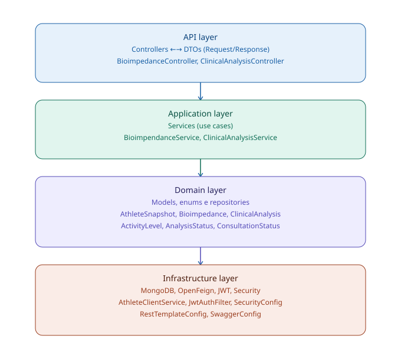
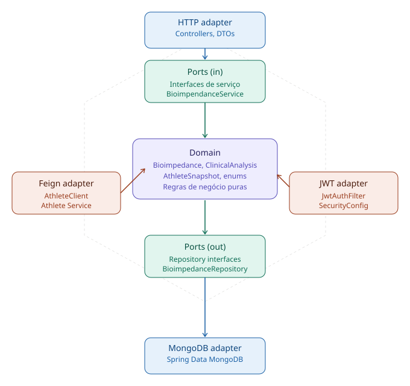

# 🏋️ microserviceTrainHealth — TrainDay Health Service

Microserviço de saúde do ecossistema **TrainDay**, uma plataforma CRM para atletas e fisiculturistas. Este serviço é responsável pelo gerenciamento de dados de saúde, incluindo bioimpedância e análise clínica dos atletas cadastrados.

---

## 📋 Sumário

- [Sobre o Projeto](#sobre-o-projeto)
- [Arquitetura](#arquitetura)
- [Stack Tecnológica](#stack-tecnológica)
- [Estrutura do Projeto](#estrutura-do-projeto)
- [Endpoints](#endpoints)
- [Configuração e Execução](#configuração-e-execução)
- [Variáveis de Ambiente](#variáveis-de-ambiente)
- [Testes](#testes)
- [Observabilidade](#observabilidade)
- [Roadmap](#roadmap)
- [Ecossistema TrainDay](#ecossistema-trainday)

---

## Sobre o Projeto

O **Health Service** é um dos microserviços que compõem o TrainDay CRM. Ele se comunica com o **Athlete Service** via OpenFeign para validar e capturar dados do atleta no momento do registro de saúde, utilizando o padrão **AthleteSnapshot** para imutabilidade histórica dos dados.

**Funcionalidades principais:**
- Registro e consulta de **bioimpedância** (composição corporal)
- Registro e consulta de **análise clínica** dos atletas
- Comunicação segura com outros microserviços via **JWT compartilhado**
- Circuit breaker com **Resilience4j** para resiliência nas chamadas externas
- Métricas expostas via **Actuator + Prometheus + Grafana**

---

## Arquitetura

O projeto segue os princípios da **Arquitetura Hexagonal (Ports & Adapters)**:





**Padrão AthleteSnapshot:** ao registrar um dado de saúde, o serviço captura e persiste um snapshot imutável dos dados do atleta via chamada ao Athlete Service. Isso garante consistência histórica mesmo que os dados do atleta mudem no futuro.

---

## Stack Tecnológica

| Tecnologia | Versão | Uso |
|---|---|---|
| Java | 21 | Linguagem principal |
| Spring Boot | 3.3.5 | Framework base |
| Spring Security | — | Autenticação e autorização |
| Spring Data MongoDB | — | Persistência de dados |
| Spring Cloud OpenFeign | 2023.0.1 | Comunicação entre microserviços |
| Resilience4j | 2.2.0 | Circuit breaker |
| JJWT | 0.11.5 | Geração e validação de tokens JWT |
| Springdoc OpenAPI | 2.6.0 | Documentação Swagger |
| Actuator + Micrometer | — | Métricas e health checks |
| Prometheus | latest | Coleta de métricas |
| Grafana | latest | Dashboards de observabilidade |
| Lombok | — | Redução de boilerplate |
| JaCoCo | 0.8.12 | Cobertura de testes |
| Docker + Docker Compose | — | Containerização |
| MongoDB Atlas | — | Banco de dados em nuvem |

---

## Estrutura do Projeto

```
src/
├── main/java/com/trainday/health_service/
│   ├── HealthServiceApplication.java
│   │
│   ├── api/
│   │   ├── controller/
│   │   │   ├── BioimpedanceController.java
│   │   │   └── ClinicalAnalysisController.java
│   │   └── DTO/
│   │       ├── Request/
│   │       │   ├── BioimpedanceRequest.java
│   │       │   └── ClinicalAnalysisRequest.java
│   │       └── Response/
│   │           └── AthleteSnapshotResponse.java
│   │
│   ├── aplication/service/
│   │   ├── BioimpendanceService.java
│   │   └── ClinicalAnalysisService.java
│   │
│   ├── domain/
│   │   ├── models/
│   │   │   ├── AthleteSnapshot.java
│   │   │   ├── Bioimpedance.java
│   │   │   ├── ClinicalAnalysis.java
│   │   │   └── enums/
│   │   │       ├── ActivityLevel.java
│   │   │       ├── AnalysisStatus.java
│   │   │       └── ConsultationStatus.java
│   │   └── repository/
│   │       ├── AthleteSnapshotRepository.java
│   │       ├── BioimpedanceRepository.java
│   │       └── ClinicalAnalysisRepository.java
│   │
│   └── infra/
│       ├── client/
│       │   ├── AthleteClient.java
│       │   └── AthleteClientService.java
│       ├── config/
│       │   └── RestTemplateConfig.java
│       └── security/
│           ├── JwtAuthFilter.java
│           ├── JwtService.java
│           └── config/
│               ├── SecurityConfig.java
│               └── SwaggerConfig.java
│
└── test/
    └── (espelho da estrutura main — cobertura em todas as camadas)
```

---

## Endpoints

A documentação interativa completa está disponível via Swagger após subir a aplicação:

```
http://localhost:8082/swagger-ui/index.html
```

### Bioimpedância

| Método | Endpoint | Descrição |
|---|---|---|
| `POST` | `/bioimpedance` | Registra avaliação de bioimpedância |
| `GET` | `/bioimpedance/{athleteId}` | Consulta histórico de bioimpedância do atleta |

### Análise Clínica

| Método | Endpoint | Descrição |
|---|---|---|
| `POST` | `/clinical-analysis` | Registra análise clínica |
| `GET` | `/clinical-analysis/{athleteId}` | Consulta histórico clínico do atleta |

> ⚠️ Todos os endpoints requerem autenticação via **Bearer Token JWT** no header `Authorization`.

---

## Configuração e Execução

### Pré-requisitos

- Java 21+
- Maven 3.9+
- Docker e Docker Compose
- Conta no MongoDB Atlas (ou instância local)

### Clonando o repositório

```bash
git clone https://github.com/Danielpernnasc/microserviceTrainHealth.git
cd microserviceTrainHealth
```

### Configurando variáveis de ambiente

Crie um arquivo `.env` na raiz do projeto **(não commitar!)**:

```env
MONGODB_URI=mongodb+srv://<usuario>:<senha>@<cluster>.mongodb.net/<database>
JWT_SECRET=sua-chave-secreta-aqui
JWT_EXPIRATION=86400000
```

> O mesmo `JWT_SECRET` deve ser configurado em todos os microserviços do ecossistema TrainDay.

### Rodando com Docker Compose (recomendado)

Sobe a aplicação junto com Prometheus e Grafana:

```bash
docker-compose up --build
```

| Serviço | URL |
|---|---|
| Health Service | http://localhost:8082 |
| Swagger UI | http://localhost:8082/swagger-ui/index.html |
| Prometheus | http://localhost:9090 |
| Grafana | http://localhost:3000 |

> Grafana: usuário `admin`, senha `admin` (altere após o primeiro acesso).

### Rodando localmente (sem Docker)

```bash
./mvnw spring-boot:run
```

---

## Variáveis de Ambiente

| Variável | Descrição | Padrão |
|---|---|---|
| `MONGODB_URI` | URI de conexão com o MongoDB Atlas | — |
| `JWT_SECRET` | Chave secreta para validação JWT (compartilhada entre serviços) | — |
| `JWT_EXPIRATION` | Tempo de expiração do token em milissegundos | `86400000` (24h) |

---

## Testes

O projeto possui cobertura de testes para todas as camadas.

### Executar todos os testes

```bash
./mvnw test
```

### Gerar relatório de cobertura (JaCoCo)

```bash
./mvnw verify
```

Relatório gerado em:

```
target/site/jacoco/index.html
```

### Camadas cobertas

| Camada | Classes testadas |
|---|---|
| Controllers | BioimpedanceController, ClinicalAnalysisController |
| Services | BioimpendanceService, ClinicalAnalysisService |
| Security | JwtAuthFilter, JwtService, SecurityConfig, SwaggerConfig |
| Domain / Enums | ActivityLevel, AnalysisStatus, ConsultationStatus |
| Infra / Client | AthleteClientService |
| Config | RestTemplateConfig |

---

## Observabilidade

A stack de observabilidade está integrada via Docker Compose com **Prometheus** e **Grafana**.

### Endpoints expostos pelo Actuator

| Endpoint | Descrição |
|---|---|
| `GET /actuator/health` | Status de saúde da aplicação |
| `GET /actuator/info` | Informações da aplicação |
| `GET /actuator/metrics` | Métricas gerais |
| `GET /actuator/prometheus` | Métricas no formato Prometheus |

### Configuração no `application.properties`

```properties
management.endpoints.web.exposure.include=health,info,prometheus,metrics
management.endpoint.health.show-details=always
management.prometheus.metrics.export.enabled=true
management.metrics.tags.application=health-service
```

O Prometheus coleta métricas automaticamente via `observability/prometheus.yml` e o Grafana as exibe em dashboards em `http://localhost:3000`.

```yaml
# observability/prometheus.yml
global:
  scrape_interval: 5s
scrape_configs:
  - job_name: 'microserviceTrainHealth'
    metrics_path: '/actuator/prometheus'
    static_configs:
      - targets: ['host.docker.internal:8082']
```

> ⚠️ **Nota:** a configuração atual usa `host.docker.internal:8082`, ou seja, o Prometheus (rodando em container) coleta métricas da aplicação executando **no host** (`./mvnw spring-boot:run`). Se você rodar a aplicação também via container do `docker-compose`, ajuste o target para `app:8082` (nome do serviço na rede `observability`).

---

## Roadmap

- [x] CRUD de Bioimpedância
- [x] CRUD de Análise Clínica
- [x] Autenticação JWT compartilhada entre microserviços
- [x] Padrão AthleteSnapshot (imutabilidade histórica)
- [x] Resilience4j — Circuit Breaker
- [x] Testes unitários em todas as camadas
- [x] Documentação Swagger / OpenAPI
- [x] Docker + Docker Compose
- [x] Observabilidade com Actuator, Prometheus e Grafana
- [ ] Kafka — mensageria assíncrona entre serviços
- [ ] CI/CD com GitHub Actions

---

## Ecossistema TrainDay

Este serviço faz parte de um sistema maior de microserviços:

| Serviço | Porta | Repositório |
|---|---|---|
| Athlete Service | 8080 | [microserviceTrainDay](https://github.com/Danielpernnasc/microserviceTrainDay) |
| Training Service | 8081 | — |
| **Health Service** | **8082** | este repositório |

---

## Autor

**Daniel Nascimento**
- GitHub: [@Danielpernnasc](https://github.com/Danielpernnasc)
- LinkedIn: [linkedin.com/in/daniel-nascimento-dev](https://www.linkedin.com/in/daniel-nascimento-dev)

---

> Projeto desenvolvido para fins de estudo e demonstração de arquitetura de microserviços com Java Spring Boot.
